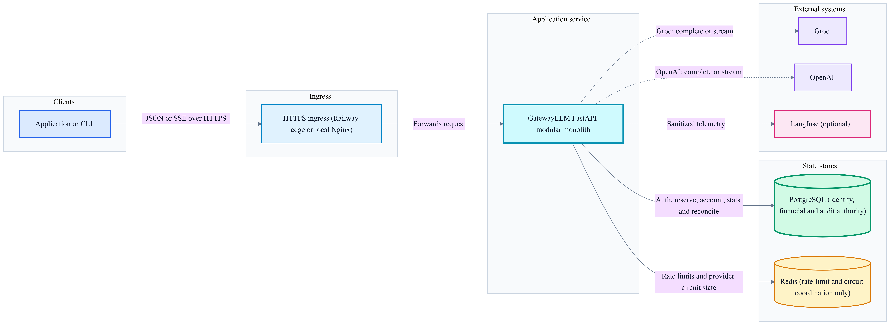
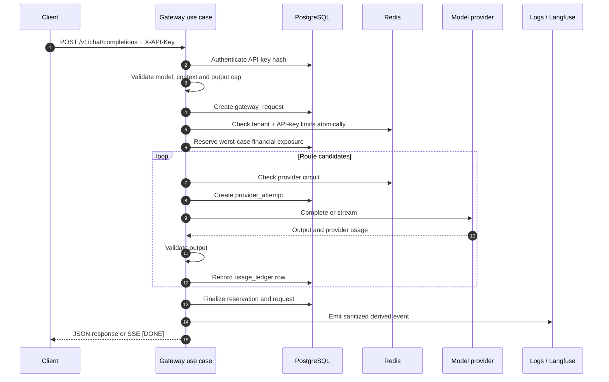
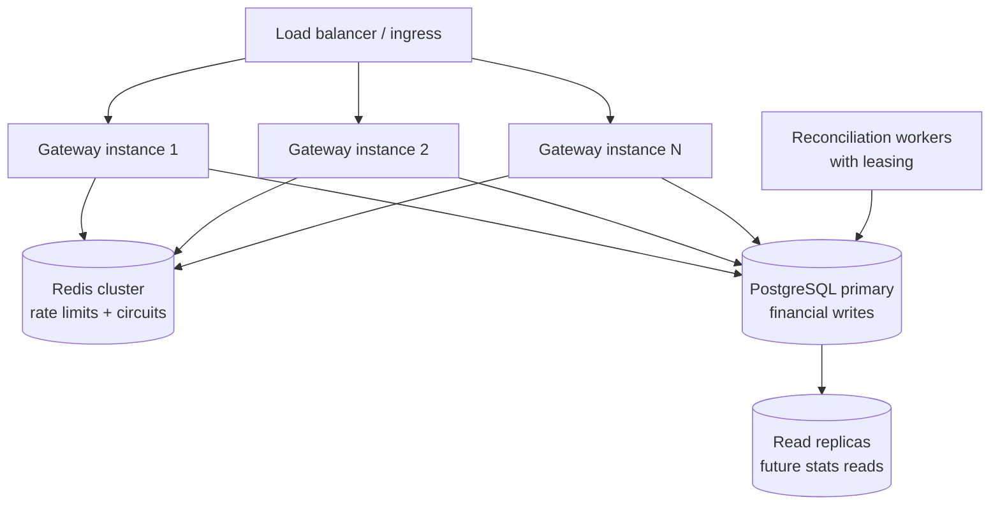

<div align="center">

# GatewayLLM

### A provider-agnostic LLM gateway with durable budgeting, failover, streaming, and attempt-level accounting

[](https://github.com/kishan0-07/LLM-Gateway/actions/workflows/ci.yml)
[](https://www.python.org/)
[](https://fastapi.tiangolo.com/)
[](https://www.postgresql.org/)
[](https://redis.io/)
[](LICENSE)

**Layer 1 of an Adaptive LLM Inference Platform**

**Deployment status:** local production shape verified ·
[Railway live smoke pending](docs/evidence/final-smoke.md)

[Quick start](#quick-start-for-forkers) ·
[Architecture](#architecture) ·
[API reference](#api-reference) ·
[Design decisions](#design-decisions) ·
[Verification](#verification-and-chaos-testing) ·
[Beginner deep dive](docs/GATEWAYLLM_BEGINNER_DEEP_DIVE.md) ·
[Code walkthrough](docs/GATEWAYLLM_CODE_WALKTHROUGH_FOR_BEGINNERS.md)

</div>

---

## What is GatewayLLM?

Calling an LLM API is one line of code. Operating that call safely is a systems
problem.

GatewayLLM sits between an application and its model providers. Before a model
generates a token, the gateway authenticates the caller, validates the request,
checks tenant and API-key rate limits, reserves the maximum financial exposure,
selects a healthy provider, and records a durable attempt. After the provider
responds, the gateway validates the output, records actual or conservative
usage, settles the reservation, and emits sanitized observability events.

The result is one API surface for:

- Groq and OpenAI provider adapters
- cross-provider routing and fallback
- PostgreSQL-authoritative budgets and usage
- atomic Redis rate limiting
- Redis-backed circuit breaking
- non-streaming and Server-Sent Events (SSE) responses
- traceable, consistent failure handling

> [!IMPORTANT]
> GatewayLLM is not positioned as a replacement for mature projects such as
> LiteLLM. It intentionally supports a small provider catalog so the production
> machinery—accounting, concurrency, failure policy, streaming finalization,
> and observability—can be understood and tested end to end.

## Why build it?

A direct provider call does not answer the operational questions that matter in
production:

- Who is allowed to call the model?
- Can the tenant afford the worst-case request?
- Can concurrent requests overspend the same budget?
- Which healthy provider should receive the request?
- What happens after a timeout, rate limit, empty response, or disconnect?
- How much did every attempted provider call cost?
- Can usage still be audited after Redis restarts or logs are dropped?

GatewayLLM treats the model call as one step inside a policy-controlled request
lifecycle. The project was built to learn those infrastructure patterns from
first principles and to serve as the foundation for later retrieval,
test-time-compute, evaluation, and self-improvement layers.

## Current capabilities

| Area | Current implementation |
|---|---|
| API | FastAPI endpoint compatible with the core OpenAI chat-completions request shape |
| Authentication | Tenant-scoped API keys, stored as hashes with a non-secret prefix |
| Providers | Groq and OpenAI behind a normalized provider contract; deterministic mock provider for tests |
| Routing | Primary model route plus cost-ordered cross-provider fallbacks |
| Budgeting | PostgreSQL budget periods, reservations, settlement, and reconciliation |
| Accounting | One durable usage-ledger row per provider attempt |
| Rate limiting | Atomic tenant and API-key sliding-window enforcement in one Redis Lua script |
| Provider health | Redis-backed closed/open/half-open circuit breaker |
| Validation | Rejects empty or unusable output without treating it as a provider-health failure |
| Streaming | SSE, provider usage events, idle/total timeouts, disconnect-safe finalization |
| Recovery | Stale-reservation reconciler and graceful shutdown draining |
| Errors | Consistent JSON envelope with trace ID and safe public messages |
| Observability | Structured JSON logs and optional Langfuse export |
| Delivery | Alembic migrations, Docker, production Compose, Nginx, and GitHub Actions CI |

## Architecture

GatewayLLM is a **modular monolith with hexagonal boundaries**. The use cases
own the complete request lifecycle, application ports define infrastructure
contracts, and adapters implement PostgreSQL, Redis, and provider-specific
behavior.



The editable Mermaid source is
[`docs/architecture.mmd`](docs/architecture.mmd). The diagram intentionally
shows deployable and external boundaries only. Gateway internals remain modules
inside one FastAPI process and are explained by the request-lifecycle sequence
below. Solid arrows represent request, financial, or coordination paths;
dotted arrows represent provider and derived-observability integrations.

### Data ownership

| System | Owns | Does not own |
|---|---|---|
| PostgreSQL | tenants, API keys, budget periods, reservations, gateway requests, provider attempts, usage ledger | transient rate-limit windows or circuit state |
| Redis | rate-limit windows and provider circuit state | money, settled usage, or the audit ledger |
| Process memory | dependency graph and tracked stream-finalizer tasks | durable request or billing truth |
| Structlog/Langfuse | derived, sanitized observability | authoritative billing records |

> [!NOTE]
> Earlier designs considered Redis budget counters. The current implementation
> deliberately keeps all financial authorization and settlement in PostgreSQL.
> Redis is coordination infrastructure, not a financial cache or source of
> truth.

## Request lifecycle

The non-streaming and streaming paths share the same policy order:



Important behavior:

1. **Authentication happens before provider work.**
2. **A gateway request is durable before rate-limit or budget failure is
   reported.**
3. **Budget capacity is reserved before any provider call.**
4. **Every started provider attempt receives a ledger outcome**, including
   failed, invalid, estimated, and uncertain attempts.
5. **An empty response may fail over but does not open the circuit.** Bad output
   and provider unavailability are different signals.
6. **A client disconnect creates durable finalization work.** The stream
   finalizer records actual or conservative usage, settles the reservation, and
   marks uncertainty for reconciliation when provider usage is unavailable.

## Core invariants

These invariants drive the implementation and tests:

- PostgreSQL is the sole authority for financial decisions.
- A provider is never called before budget authorization succeeds.
- Concurrent requests cannot approve spending against the same available
  balance without PostgreSQL serialization.
- Each provider attempt has at most one usage-ledger row.
- Request cost equals the sum of its attempt-ledger costs.
- A finalized reservation has no remaining hold.
- Logs and telemetry can fail without changing billing truth.
- Provider exception text, prompts, responses, and API keys are not exposed in
  public errors.
- Redis failure behavior is explicit: local development may fail open for rate
  limiting, while production configuration is rejected unless it fails closed.

## Design decisions

The concise rationale is below. The complete decision record, including
consequences and exact evidence for twelve architectural choices, is in
[`decisions.md`](decisions.md).

### 1. The use case owns the lifecycle

`ExecuteCompletion` and `StreamCompletion` coordinate validation, rate
limiting, reservation, routing, attempts, settlement, and events. Keeping that
transaction in one application boundary avoids “provider succeeded but budget
was never settled” gaps.

### 2. The usage ledger is billing truth

Structured logs and Langfuse are observability systems. They may be delayed,
sampled, redacted, duplicated, or unavailable. Billing is derived from durable
`provider_attempts`, `usage_ledger`, and reservation state instead.

### 3. Redis coordinates; PostgreSQL authorizes money

Redis is the right fit for short-lived rate-limit and circuit-breaker state.
PostgreSQL transactions and row locking are the right fit for auditable
financial authorization. Losing Redis must not erase spend history.

### 4. Provider attempts—not only successful requests—are billable

A timeout or unusable response can still consume provider tokens. Accounting is
attempt-scoped so fallback does not hide the cost of failed work. Provider SDK
auto-retries are disabled; GatewayLLM owns retry/failover decisions so every
external call has an explicit durable attempt.

### 5. Estimates reserve; provider usage settles

The gateway estimates input and maximum output exposure before the call.
Provider-reported usage wins when available. If usage is unavailable, the
gateway records a conservative estimate and marks its source.

### 6. Output quality is separate from provider health

Transport failures, timeouts, rate limits, and server errors affect the circuit
breaker. Empty content can trigger fallback for the caller without declaring a
healthy provider unavailable.

### 7. Streaming must always finalize

Streaming has independent idle and total timeouts. Cancellation and disconnect
paths use tracked finalizer tasks, and shutdown waits for those tasks within a
bounded grace period.

## Quick start for forkers

### Prerequisites

- Git
- Python 3.13+
- [`uv`](https://docs.astral.sh/uv/)
- Docker Desktop or Docker Engine with Compose
- at least one Groq or OpenAI API key

### 1. Clone and configure

```powershell
git clone https://github.com/kishan0-07/LLM-Gateway.git
cd LLM-Gateway

Copy-Item .env.example .env
uv sync --frozen
```

On macOS or Linux, replace `Copy-Item` with:

```bash
cp .env.example .env
```

Open `.env` and set at least one provider key:

```dotenv
GROQ_API_KEY=
OPENAI_API_KEY=
```

Do not commit `.env`.

### 2. Start PostgreSQL and Redis

```powershell
docker compose up -d --wait postgres redis
docker compose ps
```

`--wait` matters on a fresh volume: it prevents the following preflight from
racing PostgreSQL initialization.

### 3. Verify dependencies and migrate

```powershell
uv run python scripts/preflight.py
uv run alembic upgrade head
uv run alembic current
```

### 4. Create a development tenant and key

```powershell
uv run python -m app.cli.create_api_key `
  --tenant-name local-demo `
  --monthly-limit-usd 5.00
```

The command prints the API key once. Save it locally and do not commit or paste
it into logs, screenshots, issues, or documentation. The command refuses to
silently create a second active key for an existing tenant; use its explicit
rotation flow for that operation.

### 5. Run the gateway

```powershell
uv run uvicorn app.main:app --reload
```

In a second terminal:

```powershell
Invoke-RestMethod http://127.0.0.1:8000/health
Invoke-RestMethod http://127.0.0.1:8000/ready
```

Interactive API documentation is available at:

- <http://127.0.0.1:8000/docs>
- <http://127.0.0.1:8000/redoc>

### Full development stack in Docker

To run the application and its dependencies in Compose:

```powershell
docker compose up -d --build --wait
docker compose ps
Invoke-RestMethod http://127.0.0.1:8000/ready
```

Migrations run in the one-shot `migrate` service before the app is activated.
The API-key CLI is part of the installed `app` package and can be run from the
host or an authenticated container shell.

## Configuration

Configuration is loaded through `pydantic-settings`. Development values come
from `.env`; the production-shaped Compose stack uses `.env.production`.

| Variable | Default | Purpose |
|---|---:|---|
| `DATABASE_URL` | empty | Async SQLAlchemy/PostgreSQL connection URL |
| `REDIS_URL` | empty | Redis connection URL |
| `GROQ_API_KEY` | empty | Enables the Groq adapter |
| `OPENAI_API_KEY` | empty | Enables the OpenAI adapter |
| `ENVIRONMENT` | `development` | `development`, `test`, or `production`; production validates required dependencies/provider keys |
| `RATE_LIMIT_WINDOW_SECONDS` | `60` | Sliding rate-limit window |
| `RATE_LIMIT_TENANT_REQUESTS` | `120` | Tenant requests per window |
| `RATE_LIMIT_API_KEY_REQUESTS` | `60` | API-key requests per window |
| `RATE_LIMIT_REDIS_FAILURE_MODE` | `fail_open` | `fail_open` or `fail_closed` |
| `RESERVATION_RECONCILE_INTERVAL_SECONDS` | `60` | Stale-reservation scan interval |
| `SHUTDOWN_GRACE_SECONDS` | `10` | Bounded worker/finalizer shutdown window |
| `UVICORN_GRACEFUL_SHUTDOWN_SECONDS` | `50` in the container command | Server grace period; keep below the platform drain window |
| `LANGFUSE_ENABLED` | `false` | Enables optional Langfuse export |
| `LANGFUSE_PUBLIC_KEY` | empty | Required when Langfuse is enabled |
| `LANGFUSE_SECRET_KEY` | empty | Required when Langfuse is enabled |
| `LANGFUSE_BASE_URL` | Langfuse Cloud | Langfuse API endpoint |

For production-shaped testing, start from
`.env.production.example`, use strong local credentials, and set:

```dotenv
RATE_LIMIT_REDIS_FAILURE_MODE=fail_closed
LANGFUSE_ENABLED=false
```

## API reference

### Endpoints

| Method | Path | Authentication | Purpose |
|---|---|---|---|
| `GET` | `/health` | Public | Process liveness |
| `GET` | `/ready` | Public | PostgreSQL and Redis readiness |
| `GET` | `/whoami` | `X-API-Key` | Authenticated tenant and API-key identity |
| `POST` | `/v1/chat/completions` | `X-API-Key` | Non-streaming or streaming completion |
| `GET` | `/stats` | `X-API-Key` | Tenant-wide usage summary |
| `GET` | `/stats/me` | `X-API-Key` | Current API-key usage summary |

Every HTTP response includes `X-Trace-ID`. A caller may provide that header;
otherwise, the gateway generates one.

### Non-streaming completion

```bash
curl --request POST "http://127.0.0.1:8000/v1/chat/completions" \
  --header "Content-Type: application/json" \
  --header "X-API-Key: YOUR_DEVELOPMENT_KEY" \
  --data '{
    "model": "openai/gpt-oss-20b",
    "messages": [
      {
        "role": "user",
        "content": "Explain atomic budget reservation in three sentences."
      }
    ],
    "max_tokens": 200,
    "stream": false
  }'
```

Illustrative response shape:

```json
{
  "gateway_request_id": 42,
  "content": "A budget reservation...",
  "provider": "groq",
  "model": "openai/gpt-oss-20b",
  "usage": {
    "input_tokens": 18,
    "output_tokens": 74,
    "cost_usd": "0.000024"
  }
}
```

The returned cost includes all accounted attempts for that request, not only
the final successful provider.

### Streaming completion

```bash
curl --no-buffer --request POST \
  "http://127.0.0.1:8000/v1/chat/completions" \
  --header "Content-Type: application/json" \
  --header "X-API-Key: YOUR_DEVELOPMENT_KEY" \
  --data '{
    "model": "openai/gpt-oss-20b",
    "messages": [{"role": "user", "content": "Explain circuit breakers."}],
    "max_tokens": 200,
    "stream": true
  }'
```

SSE response shape:

```text
data: {"type": "delta", "content": "A circuit"}

data: {"type": "delta", "content": " breaker..."}

data: {"type": "usage", "input_tokens": 12, "output_tokens": 67}

data: [DONE]
```

`X-Accel-Buffering: no` prevents Nginx from buffering the full stream. Usage
settlement is durable before the terminal `[DONE]` event.

### Usage statistics

```bash
curl --header "X-API-Key: YOUR_DEVELOPMENT_KEY" \
  "http://127.0.0.1:8000/stats"

curl --header "X-API-Key: YOUR_DEVELOPMENT_KEY" \
  "http://127.0.0.1:8000/stats/me"
```

The response reports request totals, settled requests, input/output tokens,
total cost, failover count, and measured average/p50/p95/p99 gateway overhead.

### Error contract

HTTP failures use one public envelope:

```json
{
  "error": {
    "code": "rate_limited",
    "message": "Rate limit exceeded",
    "trace_id": "9de8f9483f8e4deea34be35c4f8fc477",
    "details": null
  }
}
```

| Condition | Status | Error code |
|---|---:|---|
| Missing or invalid API key | `401` | `authentication_failed` |
| Invalid request body | `422` | `validation_error` |
| Unknown model or invalid gateway request | `400` | `invalid_request` |
| Provider rejects the request | `400` | `invalid_request` |
| Budget unavailable for the request | `429` | `budget_exceeded` |
| Tenant or API-key rate limit reached | `429` | `rate_limited` |
| Redis unavailable in fail-closed mode | `503` | `rate_limiter_unavailable` |
| PostgreSQL unavailable | `503` | `database_unavailable` |
| Every usable provider candidate fails | `503` | `provider_unavailable` |
| Individual upstream provider failure | `502` | `provider_unavailable` |

Streaming failures that occur after HTTP headers have been sent are represented
as sanitized SSE `error` events rather than a new HTTP status.

## Supported model catalog

The catalog is deliberately explicit. A provider adapter is not automatically
allowed to serve an unregistered model.

| Requested model | Primary provider | Tokenizer hint |
|---|---|---|
| `openai/gpt-oss-20b` | Groq | `o200k_harmony` |
| `openai/gpt-oss-120b` | Groq | `o200k_harmony` |
| `gpt-5.4-mini` | OpenAI | `o200k_base` |
| `mock-model` | Test-only mock | deterministic |

Context limits, maximum output tokens, and pricing metadata live in
[`model_catalog.py`](app/application/services/model_catalog.py). Provider
pricing changes over time; review the catalog before using cost calculations in
a real billing environment.

## Observability

- `X-Trace-ID` is accepted or generated at the HTTP boundary and returned once
  on every response.
- Structlog produces JSON with timestamp, level, event name, and bound trace
  context.
- Provider streaming failures log only provider, normalized category, and
  status code when available.
- Raw provider exception bodies are not written into streaming failure logs.
- Structlog events are metadata-only; prompt and response excerpts are removed
  before application logging.
- When Langfuse is explicitly enabled, excerpts pass through email, phone, and
  SSN redaction and are truncated before export.
- Langfuse is optional and disabled by default. Its failure must not affect
  financial accounting.

> [!WARNING]
> The built-in regex sanitizer is a defensive baseline, not a compliance
> product. It does not replace a formal data-classification, retention,
> encryption, or privacy program.

## Verification and chaos testing

### Automated quality gate

Start local PostgreSQL and Redis, then run the same core checks as CI:

```powershell
docker compose up -d --wait postgres redis

uv run ruff check app tests scripts scratch load
uv run ruff format --check app tests scripts scratch load
uv run mypy app
uv run python -m compileall -q app tests scripts scratch load
uv run alembic upgrade head
uv run alembic check
uv run alembic heads
uv run pytest tests -q
docker compose config --quiet
```

The current clean-room baseline is **265 tests** across unit, contract, integration,
streaming, accounting, rate-limit, lifecycle, and priority-smoke behavior.

### Priority chaos matrix

The production-shaped stack uses the exact built image behind Nginx and tests
real dependency failures. The priority matrix has been run successfully twice
with fresh tenants and trace IDs.

| Scenario | Required evidence | Last verified result |
|---|---|---|
| Redis unavailable | `503 rate_limiter_unavailable`; no provider attempt or ledger spend | Passed |
| PostgreSQL unavailable | `503 database_unavailable`; failure before provider spend | Passed |
| Empty provider output | fallback succeeds; one ledger row per attempt; circuit remains healthy | Passed |
| SSE through Nginx | delta arrives before `[DONE]`; buffering disabled; accounting settled | Passed |
| Client disconnect | request cancelled; reservation settled; hold is zero; attempt/ledger parity | Passed |
| Recovery | stopped dependency restored and `/ready` returns healthy | Passed |

See [`scripts/chaos/README.md`](scripts/chaos/README.md) for the isolated,
destructive test procedure.

### Measured evidence

The reconciled local dogfood run contains 50 successful requests, 65 provider
attempts, 65 usage-ledger rows, zero accounting mismatches, zero active holds,
15 failovers, and `$0.028858` of accounted usage. Its measured non-stream
gateway overhead was p50 `32.5 ms`, p95 `54.3 ms`, and p99 `57.9 ms`.

These are dataset measurements, not an SLO or a hosted-capacity claim. Client
latency and stream TTFT/E2E are labeled separately in
[`docs/evidence/dogfood-summary.md`](docs/evidence/dogfood-summary.md).

The Locust harness validates both the normalized JSON contract and SSE through
`[DONE]`, but capacity stages are still pending an isolated environment,
declared provider spend/quota, connection ceilings, and Railway plan. No
1,000-concurrency result is claimed. See:

- [`Demo rehearsal`](docs/evidence/demo-run.md)
- [`Langfuse review`](docs/evidence/langfuse-review.md)
- [`Load-test status`](docs/evidence/load-test.md)
- [`Railway smoke status`](docs/evidence/final-smoke.md)

## Production-shaped Docker stack

The production Compose file uses PostgreSQL and Redis without host ports,
applies migrations in a one-shot service before app activation, starts the
exact tagged application image, and places Nginx in front of the gateway.

```powershell
Copy-Item .env.production.example .env.production
# Populate strong local credentials and provider keys in .env.production.

$env:GATEWAY_IMAGE = "llm-gateway:local"
docker build --pull -t $env:GATEWAY_IMAGE .

docker compose `
  -p gateway-production `
  --env-file .env.production `
  -f docker-compose.production.yml `
  up -d --wait postgres redis

docker compose `
  -p gateway-production `
  --env-file .env.production `
  -f docker-compose.production.yml `
  run --rm migrate

docker compose `
  -p gateway-production `
  --env-file .env.production `
  -f docker-compose.production.yml `
  up -d --wait app nginx

docker compose `
  -p gateway-production `
  --env-file .env.production `
  -f docker-compose.production.yml `
  ps

Invoke-RestMethod http://127.0.0.1/ready
```

Stop that project without deleting its database volumes:

```powershell
docker compose `
  -p gateway-production `
  --env-file .env.production `
  -f docker-compose.production.yml `
  down
```

## Security

### Implemented

- API keys are generated with cryptographically secure randomness by the
  operator CLI, which also supports guarded rotation.
- Only the API-key hash and a non-secret prefix are stored.
- Authentication resolves a tenant and exact API-key identity.
- Tenant and API-key rate limits are checked atomically.
- Production configuration must fail closed when Redis is unavailable.
- Provider calls require successful database authentication and budget
  authorization.
- Public errors use normalized messages and trace IDs instead of raw provider
  or database exception text.
- Application logs contain metadata only. Optional Langfuse excerpts are
  redacted and truncated before export.
- `.env` and `.env.production` are excluded from version control and Docker
  build context.
- The runtime image uses a non-root user.

### Not yet production-complete

- No API-key expiration, self-service revocation, or administrative
  provisioning API
- No server-side key pepper or managed key-management service
- No application-managed encryption at rest
- No IP-, device-, or organization-level abuse controls
- No formal prompt-injection or content-safety policy
- No compliance-grade PII detection or configurable retention policy
- No deployed TLS policy; TLS belongs at the production ingress
- No independent security audit or penetration test

For a real deployment, use a managed secret store, TLS termination, encrypted
volumes, narrowly scoped database credentials, key rotation, backups, alerts,
and an explicit data-retention policy.

## Project structure

```text
LLM-Gateway/
├── app/
│   ├── api/                     # Routes, schemas, dependencies, middleware
│   ├── application/
│   │   ├── ports/               # Infrastructure contracts
│   │   ├── services/            # Policy and domain services
│   │   └── use_cases/           # Complete request lifecycles
│   ├── core/                    # Settings, IDs and structured logging
│   ├── cli/                     # Safe operator tenant/API-key bootstrap
│   ├── domain/                  # Provider, auth and usage types
│   ├── infrastructure/
│   │   ├── db/                  # SQLAlchemy and PostgreSQL adapters
│   │   ├── observability/       # Structlog and Langfuse sinks
│   │   ├── providers/           # Groq, OpenAI and mock adapters
│   │   └── redis/               # Rate limiter and circuit breaker
│   └── workers/                 # Reservation reconciliation
├── alembic/                     # Database migrations
├── tests/                       # Unit, contract and integration tests
├── scripts/
│   ├── chaos/                   # Production failure-policy probes
│   ├── demo/                    # Redacted concurrent demo tooling
│   ├── dogfood/                 # Redacted run/reconciliation/summaries
│   ├── preflight.py
│   └── seed_user.py
├── load/                        # SSE-aware Locust harness and pure helpers
├── docs/
│   ├── architecture.mmd         # Editable Mermaid architecture source
│   ├── architecture.png         # README architecture export
│   ├── deployment/              # Railway operator checklist
│   └── evidence/                # Sanitized measured evidence/status
├── scratch/                     # Historical/manual development probes
├── nginx/                       # Streaming-aware reverse proxy
├── .github/workflows/ci.yml
├── decisions.md
├── docker-compose.yml
├── docker-compose.production.yml
└── Dockerfile
```

## What I would change

### If rebuilding the gateway

1. Define the accounting invariants and provider-attempt schema before writing
   the first provider adapter.
2. Keep PostgreSQL as the financial authority from the first budgeting commit
   instead of exploring Redis-backed budget ownership first.
3. Add contract tests beside every provider behavior immediately, including
   request parameters, usage normalization, and streaming errors.
4. Create one authenticated request context early so placeholders such as
   `api_key_id=0` cannot survive into rate limiting or statistics.
5. Introduce production-path chaos tests earlier; happy-path integration tests
   do not expose incorrect outage policy.
6. Treat test helpers as production code. A broken dependency override can make
   a failure-path test pass while exercising the healthy path.

### Before operating it as a paid production service

1. Add an administrative control plane for tenants, budgets, API-key rotation,
   revocation, and audit history.
2. Move reconciliation to a separately deployable worker with leasing or leader
   election for multi-instance operation.
3. Add Prometheus/OpenTelemetry metrics, latency histograms, provider
   saturation, and cost/reconciliation alerts.
4. Automate provider capability and pricing refresh with reviewed, versioned
   catalog changes.
5. Run repeatable load tests, publish p50/p95/p99 gateway overhead, and size
   PostgreSQL/Redis pools across all application replicas.
6. Add backup/restore drills, disaster-recovery targets, dependency SLOs, and a
   documented incident response process.

## Horizontal scaling

The application keeps durable truth outside the web process, which makes
horizontal scaling possible, but not automatic.



At scale, Redis keys must remain shard-local for Lua atomicity, PostgreSQL
connection budgets must include every process and replica, write paths must
continue to use the primary, and reconciliation workers need coordination to
avoid duplicated work.

## Roadmap

Completed evidence milestones:

- real-provider dogfood with reconciled cost/failover/latency metrics
- editable architecture and a clean-room quick-start validation
- redacted concurrent-demo, state-inspection, and SSE-aware load tooling

Remaining production gates:

- run the deferred load-test matrix
- add production tenant/key administration
- deploy and verify the public production path

GatewayLLM is Layer 1 of a larger planned system:

1. **Gateway** — routing, budgeting, provider execution, accounting
2. **Retrieval** — hybrid retrieval and context construction
3. **Test-time compute** — best-of-N generation and selection
4. **Evaluation and Reflexion** — quality scoring and iterative improvement

## Contributing

Issues, failure cases, architecture critiques, and focused pull requests are
welcome.

Before opening a pull request:

```powershell
uv run ruff check app tests scripts scratch load
uv run ruff format --check app tests scripts scratch load
uv run mypy app
uv run python -m compileall -q app tests scripts scratch load
uv run alembic check
uv run pytest tests -q
```

Do not include API keys, `.env` files, raw prompts/responses, or screenshots
containing secrets.

## License

Licensed under the [Apache License 2.0](LICENSE).
